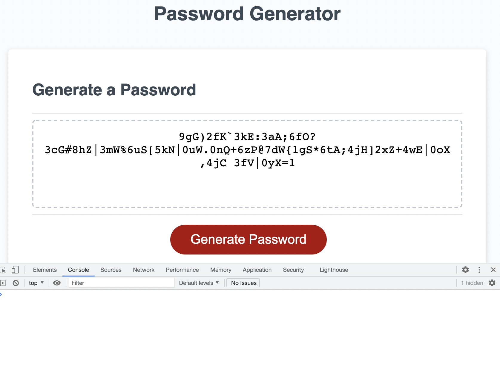

# Password-Generator-HW

## Description

A user can answer some prompts, and the computer will generate a password for them. The user must meet a few criteria when making their choices. The password cannot be shorter than 8 characters and cannot be longer than 128 characters. The user will be asked to select what character types to include; given the options of numbers, lower-case letters, upper-case letters, and special characters. The user must choose at least one character type. If at any point the user doesn't 'meet the criteria' with their input, the program will alert them. It will then continue to ask the user to make a decision that meets the criteria. At the end, the password will appear on the screen.

## Assets

The following image is a screenshot of the html file loaded in a browser. It includes a password that was generated with the process.

## Link to Live Url

Click below to open the actual link.

[The Password Generator](https://audrey-g37.github.io/Password-Generator-HW/)
